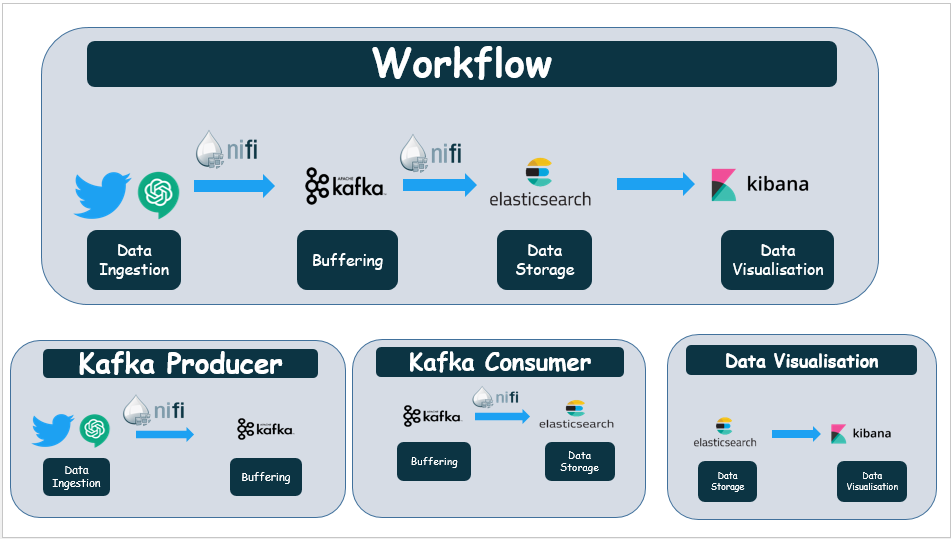

# Real-Time ChatGPT-Focused Tweets Analysis using Big Data Technologies
This pipeline is designed for real-time analysis of tweets specifically discussing **ChatGPT**, utilizing big data technologies for efficient processing and analysis. The pipeline ingests tweets in real-time using **Apache Kafka**, which allows for high-throughput data collection. The tweets are then stored in **Elasticsearch** for efficient indexing and querying. **Apache NiFi** is used for data flow management, ensuring that the tweets are properly routed and transformed as they move through the pipeline. The tweets are and visualized using **Kibana** for easy understanding and insights. **With this pipeline, users can quickly and effectively analyze large volumes of ChatGPT-focused tweets in real-time.**

